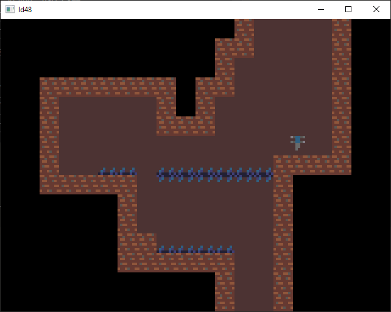

# LD48 - 
My entry to the 48th Ludum Dare.

Short little hover physics platformer where you control a drone diving ever deeper into the abyss.



Controls:
wasd/arrow keys/dpad (game controller) to move.  Moving up will jump, moving down will temporarily stop hovering.  esc to quit.
The hover physics are a bit unusual.  The goal was to allow very precise horizontal movement, with an emphasis on clinging to walls and ceilings for positioning.  The physics is not very difficult to master but I think it turned out kinda neat.

Map editor controls:
Middle click to toggle between playing and not playing.  When not in playing mode, up/down to toggle between editor modes (editing, map select, playing).
In editing mode: left/right/a/d to cycle between selections.  Mouse to move cursor, and z to change brush selection to match what cursor is hovering over.
In map select mode: left/right to toggle between maps.
In playing mode: play normally.  Middle click to return to editing mode.

Credit:
Aseprite used for making the "art".
Music procedurally generated using Abundant Music (https://pernyblom.github.io/abundant-music/index.html) and recorded with airfont 380 sound font.
Custom Lua/C game engine [j25](https://github.com/RoryHiggins/JE/tree/ld48), uses SDL2, zlib, libpng, libglew, luajit.


# J25 game engine

Lua/C game engine for game jams.  Very much WIP, only for personal use.

<!--TOC-->

- [Folder structure](#folder-structure)
- [Games](#games)
- [Getting set up](#getting-set-up)
  - [Building and running - Windows](#building-and-running---windows)
  - [Building and running - Linux](#building-and-running---linux)
  - [Dependency versions](#dependency-versions)
  - [Running the tests](#running-the-tests)

<!--TOC-->

## Folder structure
*games/* - folder containing games using the engine

*games/(game)/data/* - binary data used by the given game

*engine/* - lua game engine providing a game loop, input/output, entity component system, and other game utilities

*engine/lib/* - lua libraries used by the engine

*client/* - c client responsible for input/output for the engine, including window creation, rendering, audio

*client/data/* - binary data used by the client

*scripts/* - utility scripts for the project


## Games
[games/ld48/](games/ld48/README.md) - Ludum Dare 48 entry

## Getting set up

### Building - Windows

1. Install [MSYS2](https://www.msys2.org/)

2. Run a MSYS2 MinGW-w64 shell (open start menu, search for mingw-w64)

3. Install dependencies:
```
pacman -S --needed \
	mingw-w64-x86_64-gcc \
	mingw-w64-x86_64-make \
	mingw-w64-x86_64-ninja \
	mingw-w64-x86_64-cmake \
	mingw-w64-x86_64-glew \
	mingw-w64-x86_64-luajit \
	mingw-w64-x86_64-SDL2 \
	mingw-w64-x86_64-zlib \
	mingw-w64-x86_64-libpng \
	python3 \
	python3-pip
```

4. Checkout repository:
```
cd /c/Users/$(whoami)/Downloads
git clone git@github.com:RoryHiggins/JE.git

cd JE
```

### Building - Linux

1. Install dependencies.  With apt:
```
sudo apt update
sudo apt install gcc make ninja-build cmake libluajit-5.1-dev libsdl2-dev zlib1g-dev libpng-dev python3 python3-pip
```

4. Checkout repository:
```
cd ~/Downloads
git clone git@github.com:RoryHiggins/JE.git

cd JE
```

### Running
Everything can be done from the Makefile:
```
# build the client
make

# run the default game using the built client.  builds client if not already built
make run

# run the game headless (no client).  client calls are stubbed
make run_headless

# override the app to run
make run APP=apps/example_platformer
make run_headless APP=apps/example_platformer

# override target and rebuild client with debug logging and gdb-friendly debug symbols
make -B TARGET=DEBUG

# other client targets are:
# - RELEASE - all optimizations, no logging, no debug symbols.  for releases
# - PROFILED - release build with enough extra information to generate a profile with gprof
# - DEVELOPMENT (default) - optimized for compile-time, minimal logging
# - DEBUG - optimized for debugging.  extra static analysis tools enabled, extra gdb debugging info, and verbose logging
# - TRACE - debug build with extremely verbose logging enabled

# run game with lua debugger enabled and client running in gdb
make run_debugger

# create a fully packaged release.tar.gz which can be delivered standalone
make release APP=apps/example_platformer

# generate a performance profile using gprof.  build with TARGET=PROFILED, run game, then run this command
make profile

# clean artefacts
make clean

# apply clang-tidy static analyzer to the client code
make tidy

# apply clang-format to the client code
make format
```


### Dependency versions

Tested dependency versions:

GCC 9.3.0, 10.2.0

Make 4.1.0, 4.3.0

Ninja 1.6.0, 1.10.0

CMake 3.16.3, 3.19.1

GLEW 2.0.0, 2.2.0

LuaJIT 2.1.0

SDL2 2.0.8, SDL 2.0.12

zlib 1.2.11

libpng 1.6.34, 1.6.37

python 3.8.2, 3.9.0

pip 9.0.1, pip 20.2.0


### Running the tests
When the client is built with either the DEVELOPMENT/DEBUG/TRACE build modes, tests are run automatically at the beginning of a game.  If the build mode is DEVELOPMENT, test logging is suppressed to warnings only.
